# From Continuous Deployment

# with Jenkins Pipelines to MCP

# and LLM.

https://medium.com/@marjune?source=post_page---byline--c1adcb7a46c9---------------------------------------

https://medium.com/@marjune?source=post_page---byline--c1adcb7a46c9--------------------------------------- https://medium.com/@marjune?source=post_page---byline--c1adcb7a46c9---------------------------------------

https://medium.com/@marjune?source=post_page---byline--c1adcb7a46c9--------------------------------------- Follow

5 min read · Jun 26, 2025

https://www.anthropic.com/news/model-context-protocol

https://www.anthropic.com/news/model-context-protocol

learn how to utilize LLM for tasks beyond code generation and public

https://medium.com/@marjune/how-i-built-a-personal-docker-based-mcp-to-manage-a-k8s-cluster-94c8aa28ab74

https://medium.com/@marjune/how-i-built-a-personal-docker-based-mcp-to-manage-a-k8s-cluster-94c8aa28ab74

I created a few simple tools to interface with a Kubernetes cluster.

Moving forward, I want to add more capability where, instead of using

a CI/CD pipeline to deploy my application, LLM will take care of the

deployment on my behalf, based on certain standards, so that LLM will

not assume how to proceed. Since LLM can perfectly reason out, I’ll

communicate in a way that makes it seem like my intelligent assistant

is handling the task, removing the technical overhead associated with

operating tools like Jenkins or any other CI/CD.

Application Deployment

I created a pipeline before where I used Jenkins as my CI/CD tool for

https://medium.com/@marjune/blue-green-deployment-in-kubernetes-using-jenkins-declarative-pipeline-b5ad8e40f9c3

https://medium.com/@marjune/blue-green-deployment-in-kubernetes-using-jenkins-declarative-pipeline-b5ad8e40f9c3

https://medium.com/@marjune/blue-green-deployment-in-kubernetes-using-jenkins-declarative-pipeline-b5ad8e40f9c3

With the same application as Blue/Green. I’ll add more tools to

my MCP, like deployment from start to finish.

https://github.com/mrjbtc/mcp-k8s/tree/main

https://github.com/mrjbtc/mcp-k8s/tree/main

To help the LLM understand how to deploy my application, I created a

tool that outputs a clear, step-by-step description of the deployment

https://github.com/mrjbtc/mcp-k8s/blob/main/src/tools/deployment.py?source=post_page-----c1adcb7a46c9--------------------------------------- https://github.com/mrjbtc/mcp-k8s/blob/main/src/tools/deployment.py?source=post_page-----c1adcb7a46c9--------------------------------------- https://github.com/mrjbtc/mcp-k8s/blob/main/src/tools/deployment.py?source=post_page-----c1adcb7a46c9--------------------------------------- https://github.com/mrjbtc/mcp-k8s/blob/main/src/tools/deployment.py?source=post_page-----c1adcb7a46c9---------------------------------------

https://github.com/mrjbtc/mcp-k8s/blob/main/src/tools/deployment.py?source=post_page-----c1adcb7a46c9---------------------------------------

@mcp.tool( annotations={ "title": "How to deploy blue green", "readOnlyHint": True, "destructiveHint": False,

"openWorldHint": False } ) async def how_to_deploy_blue_green(): """ These are the steps on how to deploy Blue Green deployment """ return """ 1. Query the existing blue deployment to get the number of replicas it’s running. This ensures the green deployment will scale to match the current load. 2. Update the svc-web-app-test service to point to the green deployment by modifying its selector to app=${GREEN-ENVIRONMENT} GREEN-ENVIRONMENT = web-app-a OR web-app-b. This will route traffic to the new version for pre- release validation. 3. Update the image of the green deployment to the specified version/tag 4. Scale the green deployment to match the replica count retrieved from the blue deployment (Step 1) 5. Validate the green deployment by checking its health endpoint using the test service's IP=192.168.106.3 and NODE_PORT=30655 using the health check with the uri http://{IP}:{NODE_PORT} Monitor this endpoint for up to 3 minutes. If it doesn't consistently return HTTP 200 OK, abort the deployment. 6. Ask for approval to continue the deployment. 7. Once the health check passes, pause and wait for manual approval to proceed with production switch. 8. Update the production service svc-web-app to point to the green deployment by modifying its selector to app=${GREEN-ENVIRONMENT} GREEN- ENVIRONMENT = web-app-a OR web-app-b 9. Promote the green deployment to "blue" by updating the labels from green to blue. 10. Update the existing blue deployment’s labels to indicate it is now the "green" (standby) environment. 11. Finally, scale the old blue deployment down to zero replicas. Be careful to target the correct one (the previous production deployment, not the newly updated green). """

https://github.com/mrjbtc/mcp-k8s/tree/main/src/tools

https://github.com/mrjbtc/mcp-k8s/tree/main/src/tools

$ uv run python src/main.py [mcp.run] [available tools]: get_deployments describe_deployment get_blue_green_deployment set_image scale_replicas switch_blue_green_environment how_to_deploy_blue_green get_namespaces get_pods describe_pods get_services set_selector

Asking LLM to assist in deploying my application

As everything is prepared and ready to proceed with deployment. I

started by asking, Press enter or click to view image in full size

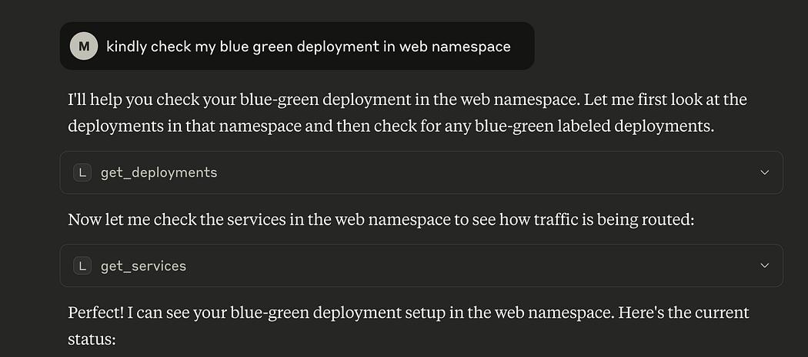

Based on my first interaction with LLM, I instructed it to check my

Blue/Green deployment in the web namespace, and it decided to

invoke some of the tools available, which are get_deployments,

and get_services. Press enter or click to view image in full size

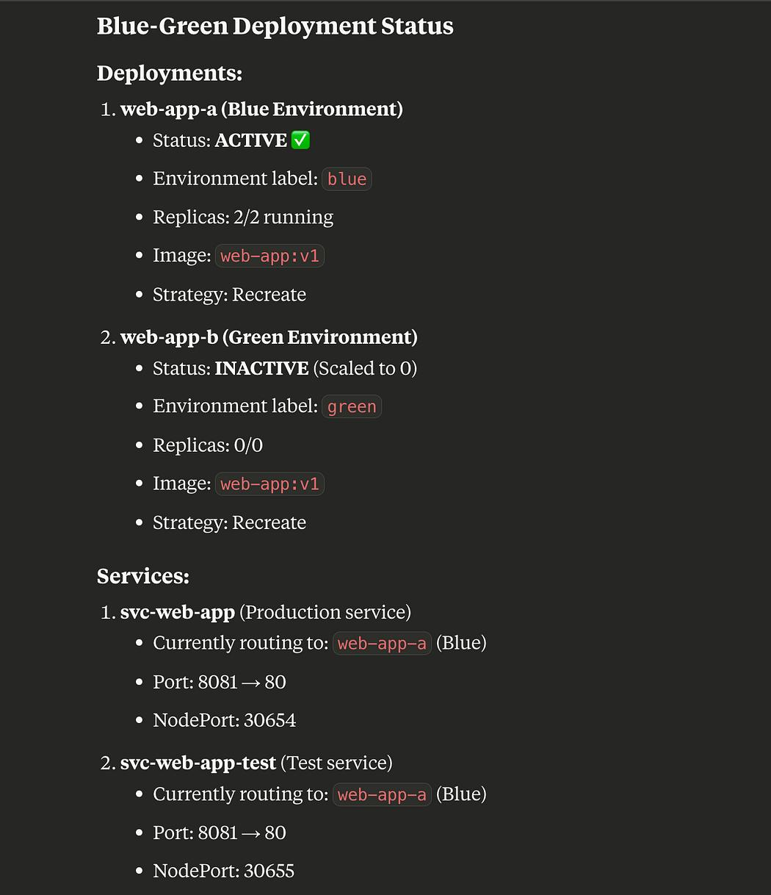

Press enter or click to view image in full size

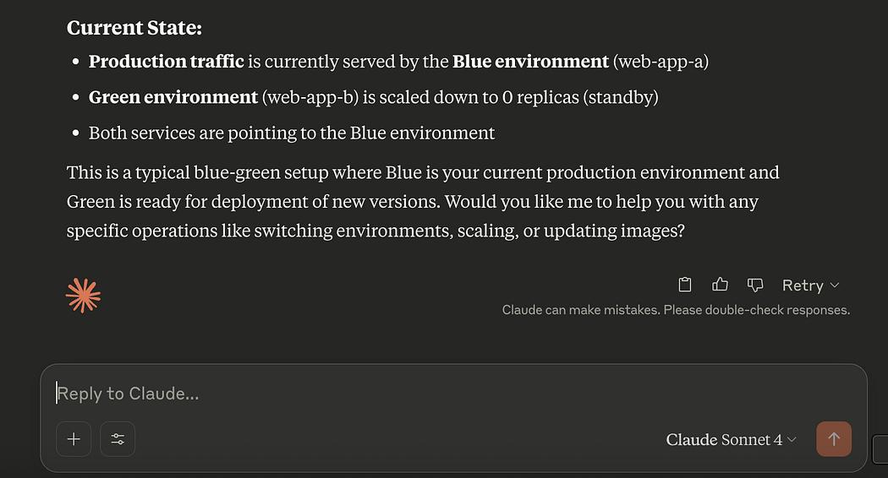

It summarizes the information from the tools. I check the production

service, which says in the NodePort:30654 Press enter or click to view image in full size

And the production environment is serving Version 1.

I then follow up with the question on how to proceed with the

blue/green deployment. Press enter or click to view image in full size

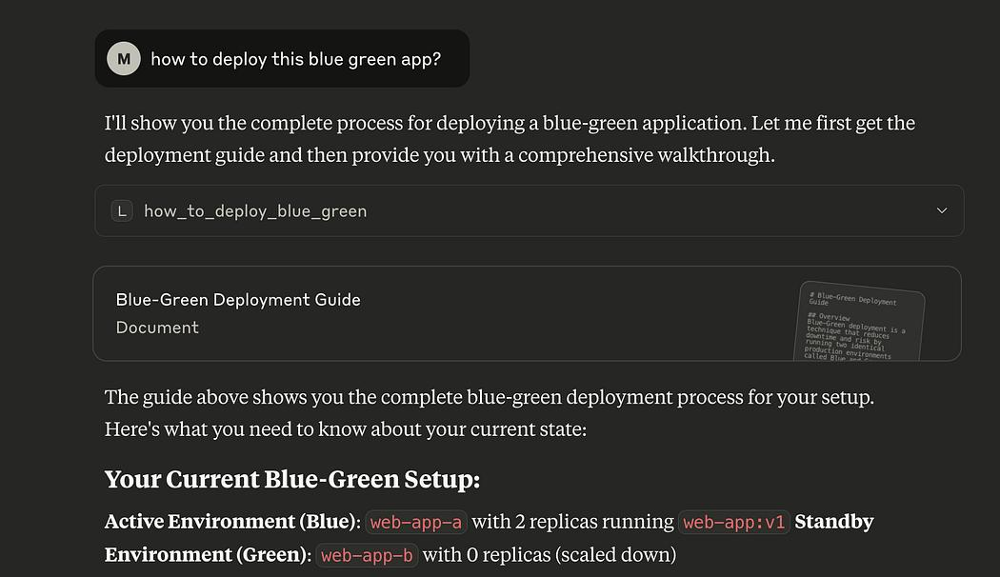

Now, the how_to_deploy_blue_green tool is being invoked. Press enter or click to view image in full size

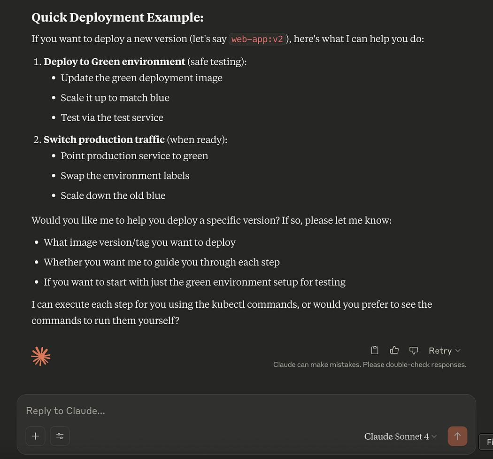

Then I gave a green signal to proceed. Press enter or click to view image in full size

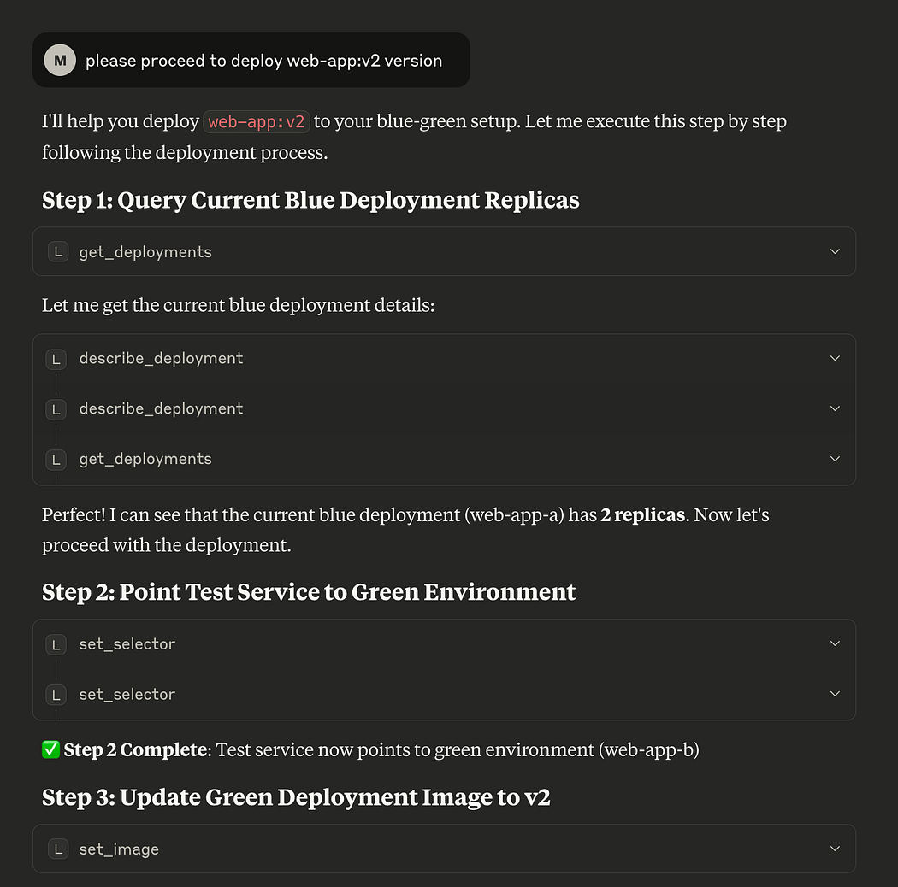

Press enter or click to view image in full size

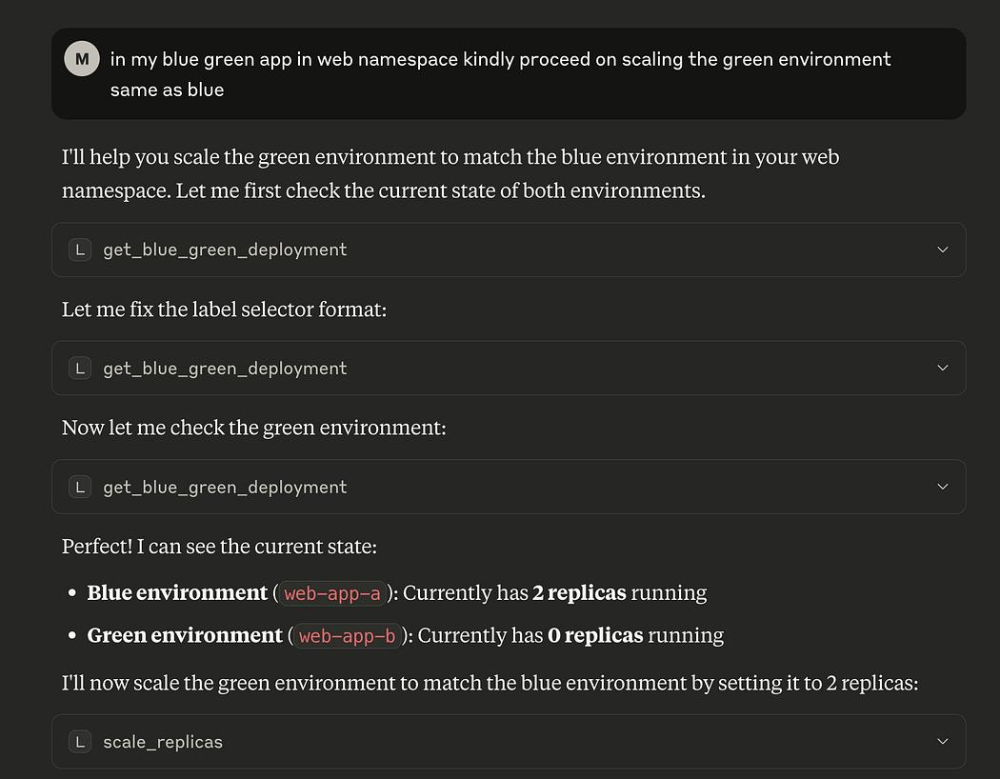

As the LLM proceeds, some tools are executed more than once due to

some errors, that’s why the model retried and re-construct the

parameters. Press enter or click to view image in full size

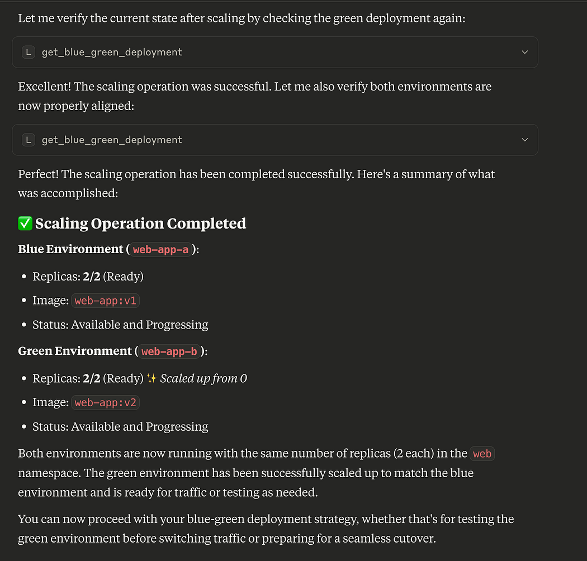

After confirming the steps above, I can now access my test service,

in NodePort: 30665. Press enter or click to view image in full size

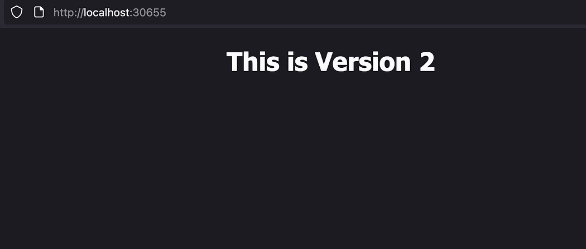

The test service endpoint is now pointing to green environment which

is serving newly deployed Version 2.

And in the Blue environment still Version 1 since I haven’t instructed

my assistant to proceed the green to production. Press enter or click to view image in full size

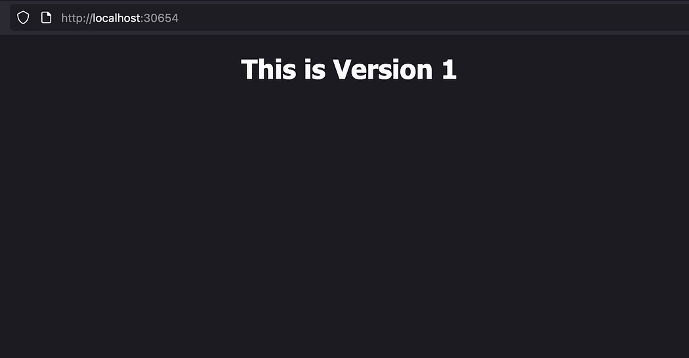

After verifying that everything looks good. I tell my assistant to

continue. Press enter or click to view image in full size

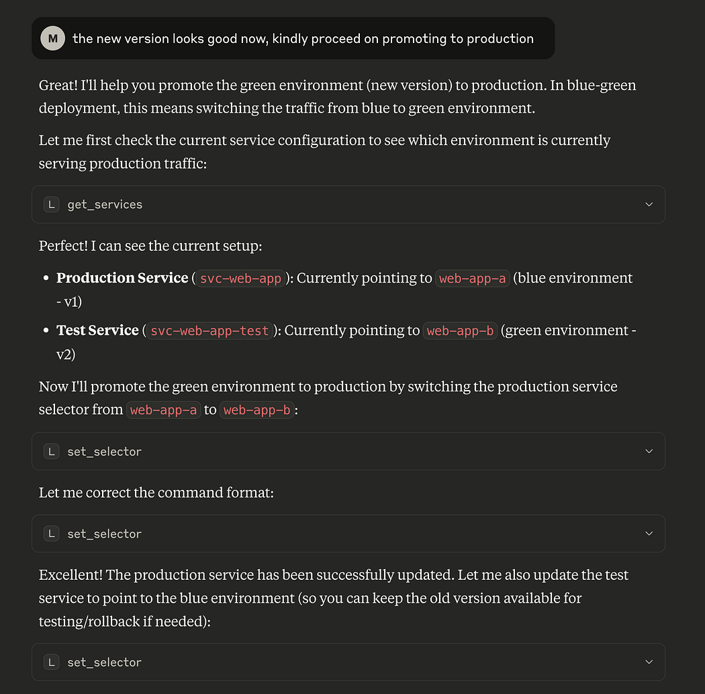

Press enter or click to view image in full size

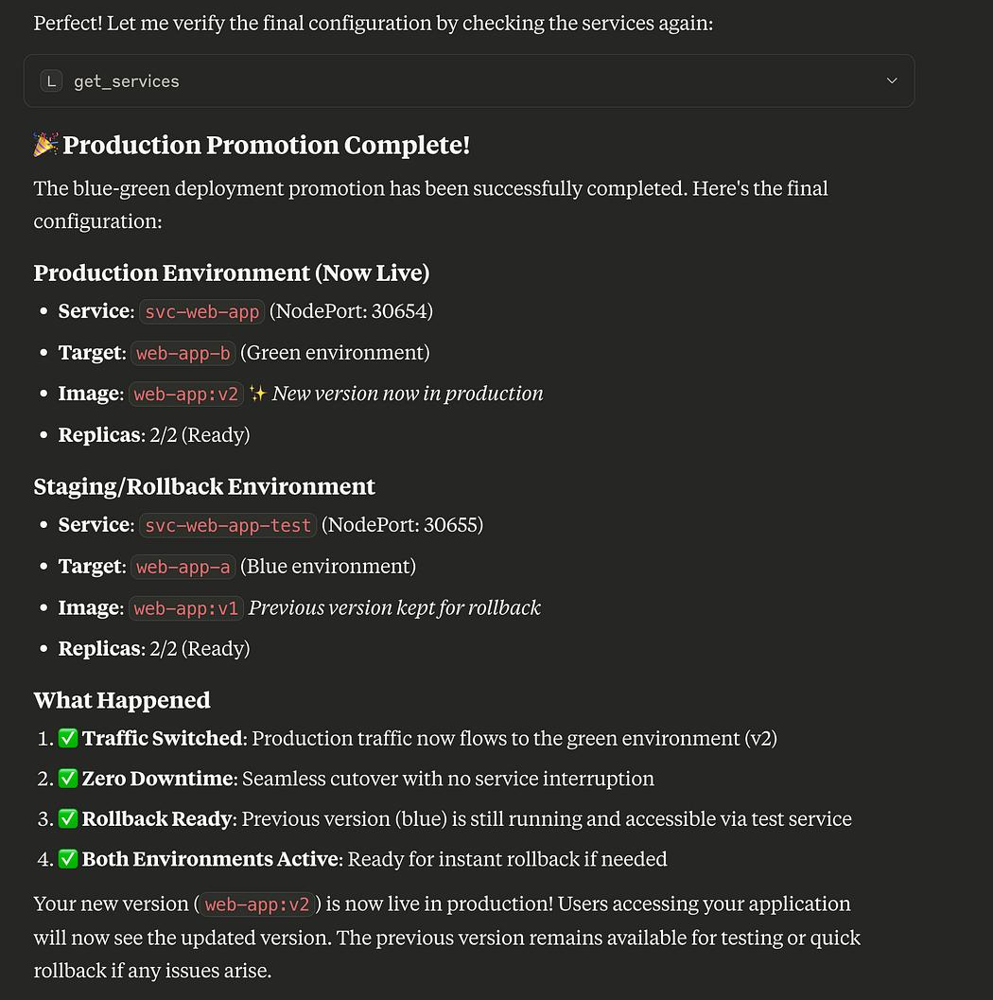

Press enter or click to view image in full size

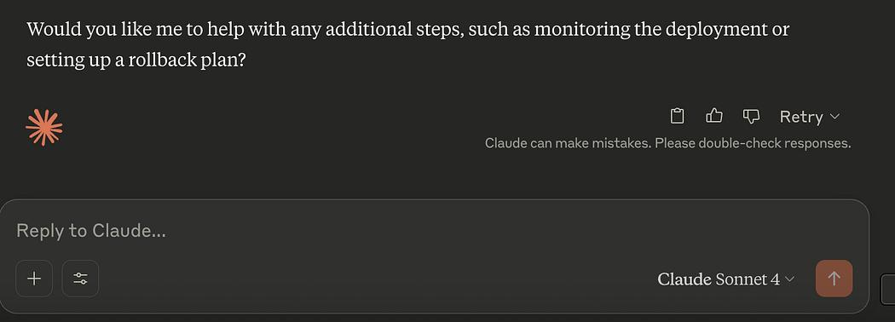

And there it is, deployment was successful. The production endpoint

in 30654 port is now pointing to the new version of the application. Press enter or click to view image in full size

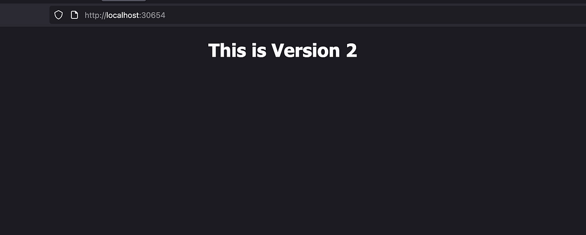

Final Thoughts

Deployment becomes effortless through a simple conversation.

If something goes wrong, I can instruct the LLM to initiate a rollback.

Additionally, we can integrate more automated tests and allow the

LLM to monitor system behavior post-deployment. Based on

predefined criteria, it can autonomously decide whether a rollback is

necessary.

As we continue developing MCP, a good rule of thumb is to design

tools that are focused and narrowly scoped. Avoid relying on the LLM

to generate or execute high-risk, destructive commands. Always

consider RBAC(Role-Based Access Control).
